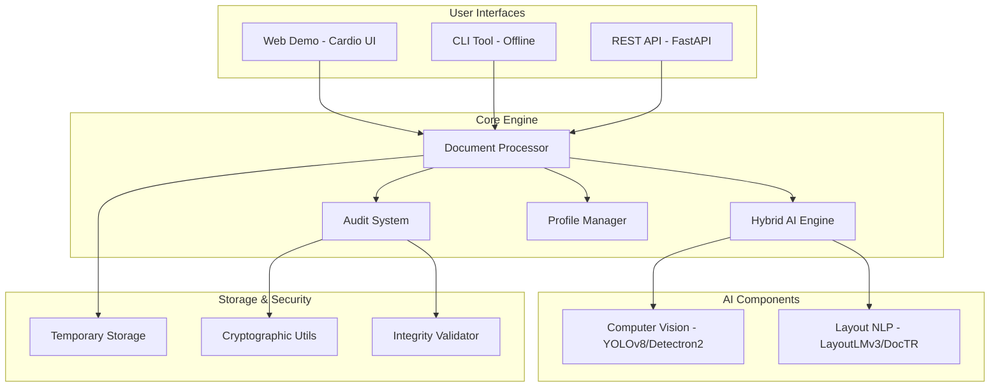

# Design Document

## Overview

Gopnik is architected as a modular, AI-powered deidentification system with three distinct interfaces sharing a common core engine. The design emphasizes security, accuracy, and maintainability while supporting diverse deployment scenarios from air-gapped environments to cloud-based processing.

## Architecture

### High-Level Architecture



### Core Design Principles

1. **Privacy by Design**: All processing can occur offline, temporary files are securely deleted
2. **Modular Architecture**: Shared core with interface-specific wrappers
3. **Forensic Grade**: Cryptographic audit trails and integrity validation
4. **Extensible AI**: Plugin architecture for different AI models
5. **Configuration Driven**: YAML/JSON profiles for customizable behavior

## Components and Interfaces

### 1. Document Processor (Core Engine)

**Purpose**: Central orchestrator for all document processing operations

**Key Classes**:
- `DocumentProcessor`: Main processing coordinator
- `DocumentAnalyzer`: Handles document parsing and structure analysis
- `RedactionEngine`: Applies redactions while preserving layout
- `OutputGenerator`: Creates final redacted documents

**Interfaces**:
```python
class DocumentProcessor:
    def process_document(self, input_path: str, profile: RedactionProfile) -> ProcessingResult
    def validate_document(self, document_path: str, audit_path: str) -> ValidationResult
    def batch_process(self, input_dir: str, profile: RedactionProfile) -> List[ProcessingResult]
```

### 2. Hybrid AI Engine

**Purpose**: Combines computer vision and NLP for comprehensive PII detection

**Components**:
- **Visual PII Detector**: Uses YOLOv8/Detectron2 for faces, signatures, barcodes
- **Text PII Detector**: Uses LayoutLMv3/DocTR for layout-aware text analysis
- **Result Merger**: Combines and deduplicates findings from both engines

**Key Classes**:
```python
class HybridAIEngine:
    def __init__(self, cv_model: str = "yolov8", nlp_model: str = "layoutlmv3")
    def detect_visual_pii(self, image: np.ndarray) -> List[PIIDetection]
    def detect_text_pii(self, document: Document) -> List[PIIDetection]
    def merge_detections(self, visual: List[PIIDetection], text: List[PIIDetection]) -> List[PIIDetection]
```

### 3. Profile Manager

**Purpose**: Manages custom redaction profiles and rules

**Features**:
- YAML/JSON profile parsing
- Rule validation and conflict resolution
- Profile inheritance and composition
- Runtime profile switching

**Profile Schema**:
```yaml
name: "healthcare_hipaa"
description: "HIPAA compliant redaction for healthcare documents"
rules:
  visual_pii:
    - faces: true
    - signatures: true
    - barcodes: false
  text_pii:
    - names: true
    - emails: true
    - phone_numbers: true
    - addresses: true
    - ssn: true
  redaction_style:
    color: "black"
    pattern: "solid"
```

### 4. Audit System

**Purpose**: Provides forensic-grade audit trails and integrity validation

**Components**:
- **Audit Logger**: Records all processing steps with timestamps
- **Cryptographic Hasher**: Generates SHA-256 hashes for integrity
- **Digital Signer**: Creates cryptographic signatures for validation
- **Integrity Validator**: Verifies document authenticity

**Audit Log Format**:
```json
{
  "document_id": "uuid",
  "timestamp": "2024-01-15T10:30:00Z",
  "operation": "redaction",
  "profile": "healthcare_hipaa",
  "detections": [
    {
      "type": "face",
      "coordinates": [100, 150, 200, 250],
      "confidence": 0.95
    }
  ],
  "hash_original": "sha256_hash",
  "hash_redacted": "sha256_hash",
  "signature": "cryptographic_signature"
}
```

### 5. Web Interface (Cardio-based)

**Purpose**: User-friendly web demo with drag-and-drop functionality

**Technology Stack**:
- Frontend: Cardio library for modern UI components
- Backend: FastAPI for API endpoints
- Security: Cloudflare WAF and rate limiting
- File Handling: Temporary storage with automatic cleanup

**Key Features**:
- Drag-and-drop file upload
- Real-time processing status
- Interactive help sidebar
- Profile selection interface
- Download redacted documents

### 6. CLI Interface

**Purpose**: Forensic-grade command-line tool for offline processing

**Command Structure**:
```bash
gopnik process --input document.pdf --profile healthcare --output redacted.pdf
gopnik validate --document redacted.pdf --audit audit.json
gopnik batch --input-dir ./documents --profile legal --output-dir ./redacted
gopnik profile --create --name custom --config profile.yaml
```

**Features**:
- Comprehensive help system
- Progress bars for batch operations
- Detailed error reporting
- Configuration file support

### 7. REST API Interface

**Purpose**: Developer-friendly API for system integration

**Endpoints**:
```
POST /api/v1/process
POST /api/v1/batch
GET /api/v1/validate/{document_id}
GET /api/v1/profiles
POST /api/v1/profiles
GET /api/v1/health
```

**Features**:
- FastAPI auto-generated documentation
- Async processing for large files
- Webhook support for completion notifications
- Rate limiting and authentication

## Data Models

### Core Data Structures

```python
@dataclass
class PIIDetection:
    type: PIIType
    coordinates: Tuple[int, int, int, int]
    confidence: float
    text_content: Optional[str] = None
    metadata: Dict[str, Any] = field(default_factory=dict)

@dataclass
class ProcessingResult:
    document_id: str
    input_path: str
    output_path: str
    detections: List[PIIDetection]
    audit_log: AuditLog
    processing_time: float
    success: bool
    errors: List[str] = field(default_factory=list)

@dataclass
class RedactionProfile:
    name: str
    description: str
    visual_rules: Dict[str, bool]
    text_rules: Dict[str, bool]
    redaction_style: RedactionStyle
    multilingual_support: List[str]
```

### Database Schema (for API version)

```sql
-- Processing jobs table
CREATE TABLE processing_jobs (
    id UUID PRIMARY KEY,
    status VARCHAR(20) NOT NULL,
    input_filename VARCHAR(255),
    profile_name VARCHAR(100),
    created_at TIMESTAMP DEFAULT NOW(),
    completed_at TIMESTAMP,
    error_message TEXT
);

-- Audit logs table
CREATE TABLE audit_logs (
    id UUID PRIMARY KEY,
    job_id UUID REFERENCES processing_jobs(id),
    operation VARCHAR(50),
    timestamp TIMESTAMP DEFAULT NOW(),
    details JSONB
);
```

## Error Handling

### Error Categories

1. **Input Validation Errors**: Invalid file formats, corrupted files
2. **Processing Errors**: AI model failures, memory issues
3. **Configuration Errors**: Invalid profiles, missing dependencies
4. **Security Errors**: Integrity validation failures, unauthorized access
5. **System Errors**: Disk space, network connectivity (API only)

### Error Response Format

```python
@dataclass
class ErrorResponse:
    error_code: str
    message: str
    details: Dict[str, Any]
    timestamp: datetime
    request_id: str
    suggestions: List[str]
```

### Recovery Strategies

- **Graceful Degradation**: Fall back to simpler models if advanced ones fail
- **Partial Processing**: Continue with successful detections if some fail
- **Retry Logic**: Automatic retry for transient failures
- **User Feedback**: Clear error messages with actionable suggestions

## Testing Strategy

### Unit Testing

- **AI Engine Tests**: Mock model outputs, test detection merging
- **Profile Manager Tests**: Validate YAML parsing, rule conflicts
- **Audit System Tests**: Verify cryptographic operations
- **Document Processor Tests**: Test redaction accuracy and layout preservation

### Integration Testing

- **End-to-End Workflows**: Complete document processing pipelines
- **Interface Testing**: Web UI, CLI commands, API endpoints
- **Security Testing**: Audit trail integrity, file cleanup verification
- **Performance Testing**: Large document processing, batch operations

### Test Data Strategy

- **Synthetic Documents**: Generated test documents with known PII
- **Public Datasets**: SignverOD Kaggle dataset for signature detection
- **Multilingual Samples**: Documents in various languages and scripts
- **Edge Cases**: Corrupted files, unusual layouts, mixed content types

### Continuous Testing

```yaml
# GitHub Actions workflow
name: Gopnik CI/CD
on: [push, pull_request]
jobs:
  test:
    runs-on: ubuntu-latest
    steps:
      - uses: actions/checkout@v2
      - name: Setup Python
        uses: actions/setup-python@v2
        with:
          python-version: '3.9'
      - name: Install dependencies
        run: pip install -r requirements.txt
      - name: Run unit tests
        run: pytest tests/unit/
      - name: Run integration tests
        run: pytest tests/integration/
      - name: Security scan
        run: bandit -r src/
      - name: Performance benchmarks
        run: python benchmarks/run_benchmarks.py
```

### Performance Benchmarks

- **Processing Speed**: Documents per minute for various sizes
- **Memory Usage**: Peak memory consumption during processing
- **Accuracy Metrics**: Precision/recall for PII detection
- **Scalability**: Performance degradation with concurrent users (API)

## Security Considerations

### Data Protection

- **Temporary File Encryption**: All temporary files encrypted at rest
- **Secure Deletion**: Cryptographic wiping of temporary files
- **Memory Protection**: Sensitive data cleared from memory after use
- **Access Controls**: File permissions and user isolation

### Cryptographic Standards

- **Hashing**: SHA-256 for document integrity
- **Signatures**: RSA-2048 or ECDSA for audit log signing
- **Encryption**: AES-256 for temporary file protection
- **Key Management**: Secure key generation and storage

### Compliance Features

- **GDPR Compliance**: Right to deletion, data minimization
- **HIPAA Compliance**: Healthcare-specific redaction profiles
- **Legal Standards**: Forensic-grade audit trails for court admissibility
- **Industry Standards**: SOC 2, ISO 27001 alignment